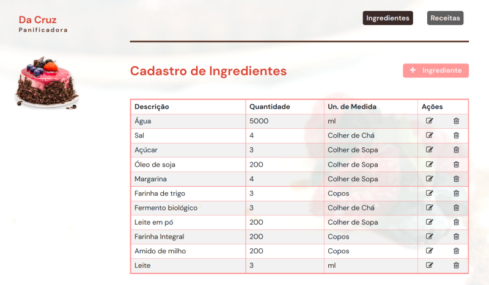
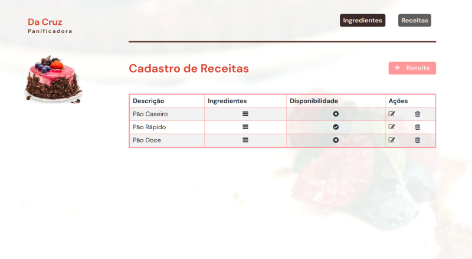
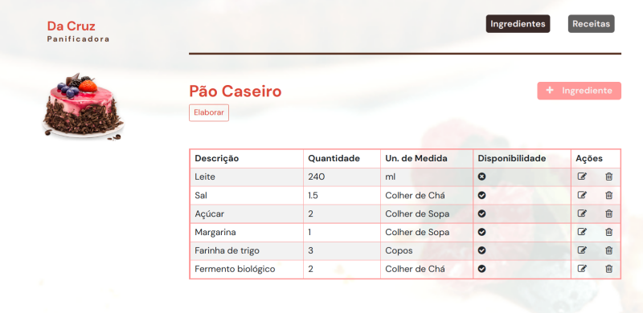

# da Cruz Panificadora
Este é um projeto criado para a disciplina de Linguagem de programação III

## Pré-requisitos

É necessário ter o NodeJs instalado localmente para executar o projeto. Favor seguir os passos descritos no [Site NodeJs](https://nodejs.org/en/download/)

## Execução
Entrar na pasta raiz do projeto via terminal e inserir o comando `npm run dev` command.
Após iniciar, abrir a url http://localhost:3000/ no seu browser. 
Deve aparecer a tela inicial com o cadastro de ingredientes.

## Backend

No mesmo terminal, é possível testar alguns comandos:
- `nodes` - Lista informações do backend.
- `services` - Lista todos os serviços disponíveis via API.

## Frontend

A aplicação estará disponível na url http://localhost:3000/ e terá as seguintes telas:

### Cadastro de Ingredientes
 
### Cadastro de Receitas

### Ingredientes x Receita
 

## Banco de dados
- O sqlite3 foi o banco utilizado e o arquivo de conexão está na pasta do projeto /data/dacruz.db
- Para visualizar os registros, é possível usar o site online [Sqlite Viewer](https://sqliteviewer.app/)  

